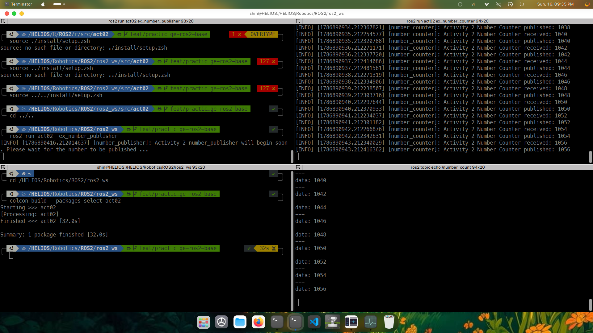

# Activity 02: Number Publisher and Counter

This package demonstrates ROS 2 publisher/subscriber communication in C++ with
`example_interfaces/msg/Int64` messages.

## How it works

```text
number_publisher -- /number --> number_counter -- /number_count --> output
```

- `number_publisher` publishes the value `0` to `/number` once per second.
- `number_counter` subscribes to `/number`, adds the received value and `2` to
  its running counter, then publishes the result to `/number_count`.
- Both publishers and the subscription use a queue depth of `10`.

With the publisher sending `0`, `/number_count` produces the sequence `2, 4,
6, ...`.

## Build

Run the build command from the ROS 2 workspace root:

```bash
cd ros2_ws
source /opt/ros/jazzy/setup.zsh
colcon build --packages-select act02 --symlink-install
source install/setup.zsh
```

## Run

Start the counter:

```bash
ros2 run act02 ex_number_counter
```

Start the publisher in another sourced terminal:

```bash
ros2 run act02 ex_number_publisher
```

Inspect the counter output in a third sourced terminal:

```bash
ros2 topic echo /number_count
```

## Result


